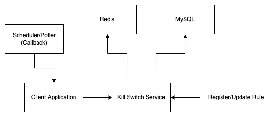
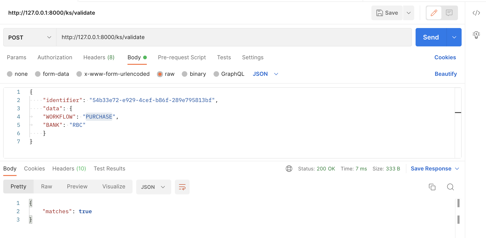
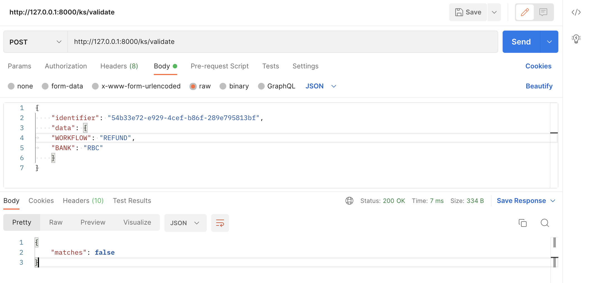
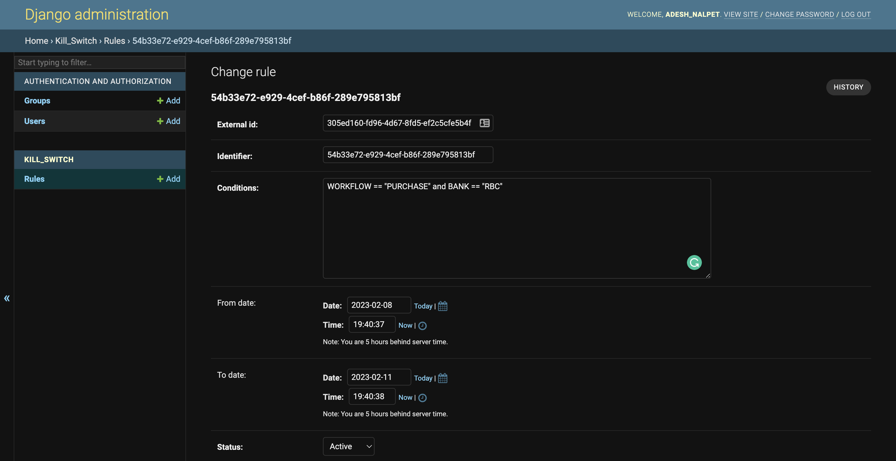

# Kill Switch Service (Work in Progress)

### Installation
- [Django Installable Guide](https://realpython.com/installable-django-app/)
- Install Dependencies: `pip install -r requirements.txt`
- Migrations: `python manage.py makemigrations` and `python manage.py migrate`
- Start server: `python manage.py runserver`

<hr>

### Working Overview
The basic idea of the "kill-switch" is to take a JSON input and evaluate a set of rules on the input JSON and return the match result. 
After that, it's up to the receiver to decide the action item; one go-to approach is to throw an exception with a custom status code and configure the client-side pages to display a relevant message such as "Temporarily blocked."

For example: Let's say there's a workflow in the application where the purchase of an order is fulfilled, and HSBC bank is temporarily down, or there's a bug identified; hence, to block such workflows, one would create a kill-switch rule which matches to True for `PURCHASE` workflow of `HSBC` bank.

- Predefined Rule: `WORKFLOW == "PURCHASE" and BANK == "HSBC"` 
- JSON input: `{"WORKFLOW": "PURCHASE", "BANK": "HSBC"}`
- Output: `True`

<hr>

### Model
The different fields of a rule are as follows:
- `ID`: A Unique Identifier.
- `Conditions`: To evaluate the input JSON.
- `Time Interval`: From and to interval (Validity/Expiry of the rule).
- `Frequency`: Frequency of rule evaluation (Defaults to 30 seconds).
- `Status`: Active/Inactive.

<hr>

### System Design
While implementing a simple rule engine for the given JSON is relatively easy, the expectation is that most APIs in the backend application would need to call the Kill-switch service to evaluate. Hence, ensuring low latency is of a higher priority.

The kill-switch service can store the ruleset in a key-value cache-store such as Redis with a longer TTL and update the cache when the rules are expired or modified.

The application calling the kill-switch service still has to bear the network latency to make the API call, possibly for most backend APIs. Using another layer of Redis is a bad idea, given the TTL may have to be seconds. A better approach is to load the kill-switch rules relevant to the integrated application at run-time for a predefined frequency, using a scheduler + queue combination.

The barebone implementation of KS: [https://github.com/addu390/kill-switch](https://github.com/addu390/kill-switch)

The different **components** involved are as follows:



- **Data Store (MySQL):** To validate and store the rule(s).

- **Queue (RabbitMQ/Kafka):** (for Client application) Scheduler callback pushed to a queue to import the kill-switch rules (in-memory).

- **Key-value Cache (Redis):** To cache the rules to facilitate low latency API calls.

<hr>

### Conclusion
The use-case(s) of the kill-switch service spans across domains. All it takes is a set of key-value pairs and rule(s) to validate the key-value pairs, followed by an action item in complete control of the client. Be it temporarily blocking a workflow, a set of users, a tool, or even resources. However, it's important to use KS for its prime purpose and not force-fit to other use-cases like A/B testing.

<hr>

### Example:
- JSON input:
```
{
	"WORKFLOW": "PURCHASE",
	"BANK": "RBC"
}
```

### Case 1

- Predefined Rule: `WORKFLOW == "PURCHASE" and BANK == "RBC"`
- Output: `True`



### Case 2

- Predefined Rule: `WORKFLOW == "REFUND" and BANK == "RBC"`
- Output: `False`



### Rule Definition (Admin Panel)


